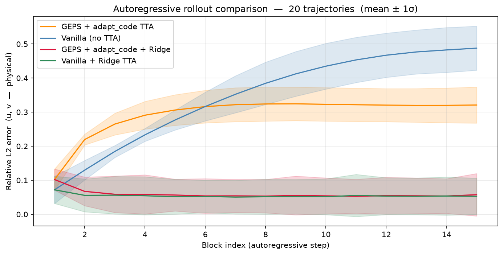

# RealPDE Track 2: GEPS U-Net + Ridge TTA

Code for our submission to the [RealPDE Track 2 (LTTTA)](https://realpdecompetition.github.io/) competition at NeurIPS 2026. The task is long-term test-time adaptation on real-world PIV measurements of airfoil flows, with unseen angle-of-attack (AoA) and Reynolds number (Re) combinations at evaluation time.



**Result**: combining GEPS environment-code adaptation with last-layer ridge regression achieves **83% reduction in relative L2 error** over a frozen no-adaptation baseline, updating only **203 parameters** versus ~23M in full fine-tuning.

---

## Method

### 1. GEPS: Low-Rank Adaptive Conditioning

Standard neural PDE surrogates use a single fixed weight matrix $W$ for all environments. GEPS replaces each convolution with a low-rank modulated kernel:

$$W_{\text{eff}} = W + A\,\mathrm{diag}(c^e)\,B$$

where $A, B$ are low-rank factor matrices shared across environments, and $c^e \in \mathbb{R}^r$ ($r \ll \text{model dim}$) is a per-environment code that compresses inter-environment variation into a small latent space. An environment is defined by its boundary conditions, initial-condition distribution, PDE coefficients, and forcing term.

**Training** jointly optimizes $W, A, B$ and a codes matrix $\{c^e\}$ (one row per environment). Each long trajectory is sliced into length-20 windows via a sliding window, treating them as multiple trajectories sharing the same $c^e$.

- **Pretrain** (simulated data): 20,000 steps, effective batch size 16, cosine annealing lr 1e-4.
- **Finetune** (real PIV data): load pretrained $W, A, B$, replace codes matrix with one for real environments. 10,000 steps, lr 5e-5.

**Test-time adaptation**: freeze $W, A, B$. Initialize `adapt_code` $\bar{c} = \frac{1}{N}\sum_e c^e$ (mean of finetune codes). On each new observation block, update only `adapt_code` via one Adam gradient step — 8 parameters total.

### 2. Ridge Last-Layer TTA

The final 1×1×1 Conv3d output layer ($W_{\text{out}} \in \mathbb{R}^{d_{\text{out}} \times d}$) admits a closed-form ridge regression update. Given feature map $\Phi$ captured via a forward hook and revealed ground truth $Y$:

$$W_{\text{new}} = \arg\min_{W} \|\Phi W - Y\|_F^2 + \lambda \|W - W_0\|_F^2$$

solved in one shot as $({\Phi}^\top \Phi + \lambda I)^{-1}(\Phi^\top Y + \lambda W_0)$, regularized toward the pretrained weights $W_0$. No gradient computation, no learning rate tuning. Updates ~195 parameters per block.

Both mechanisms are **causally correct**: adaptation at block $b$ uses only the revealed ground truth from block $b-1$.

---

## Repository Structure

```
models/
    unet_geps.py          # GEPS-conditioned 3D U-Net
    geps_layers.py        # GEPSConv3D: low-rank modulated convolution
    unet.py               # Vanilla 3D U-Net baseline
tta/
    geps_adapter.py       # adapt_code TTA (online gradient descent on c^e)
    ridge_tta.py          # last-layer ridge regression TTA
training/
    geps_train.py         # two-stage pretrain + finetune
    baseline_train.py     # vanilla U-Net training
evaluation/
    sps_calibration.py    # Safe Prediction Score interval calibration
    compare_methods.py    # 4-condition ablation (generates the plot above)
    online_tta.py         # vanilla + ridge TTA evaluation
    online_tta_geps.py    # GEPS + adapt_code TTA evaluation
submission/
    submission.py         # competition entry point (get_ttt_model + ttt_step)
einops_exts/              # vendored dependency
rotary_embedding_torch/   # vendored dependency
results/
    rel_l2_curve.png      # ablation result
```

---

## Ablation

Four conditions evaluated on 20 real foil test trajectories, 15-block autoregressive rollout (300 frames per trajectory):

| Condition | Rel L2 (mean) | Parameters updated |
|-----------|:---:|:---:|
| Vanilla, no TTA | 0.344 | 0 |
| GEPS + adapt_code TTA | 0.293 | 8 |
| Vanilla + Ridge TTA | 0.054 | 195 |
| **GEPS + adapt_code + Ridge TTA** | **0.059** | **203** |

Ridge TTA is the dominant contributor. The adapt_code mechanism alone yields a further ~15% improvement over the frozen baseline.
